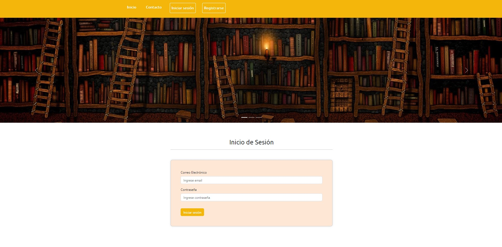
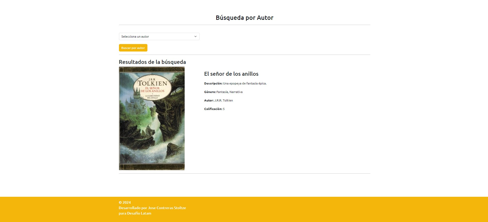

# Plataforma de Reseñas de Libros

## Descripción del Proyecto

Se trata de un sitio web dinámico y responsivo que facilita la gestión de reseñas de libros, permitiendo a los usuarios escribir reseñas, calificar libros y seguir a autores. Esta plataforma ofrece una experiencia de usuario fluida y adaptable en diversos dispositivos, garantizando que los usuarios puedan interactuar de manera intuitiva y accesible.

En sitio cuenta con un formulario de contacto y la posibilidad de registrarse, iniciar sesión y cerrar sesión.

Para usuarios con sesión iniciada se podrá ver la lista de libros precargados, ver el detalles de cada uno y sus comentarios, postear nuevos comentarios y realizar búsquedas por autor, categoría y calificación.

Los usuarios que sean administradores podrán acceder a agregar libros en el sitio. Las imagenes de portadas son opcionales, es decir, si no se ingresan, llevan una imagen por defecto; y si se inegresa, debe ser una url que no es otra cosa que la ubicación de la imagen en la carpeta static 'img/imagenes_de_prueba/nombre_archivo.extension'.

## Tecnologías Frontend

- HTML
- CSS
- Bootstrap
- JavaScript
- jQuery

## Tecnologías Backend

- Python
- Django

## Base de Datos

- PostgreSQL

## Capturas de Pantalla del Proyecto

Se incluyen capturas de pantalla de las siguientes vistas:

- 
  Vista inicio de la aplicación.

- 
  Vista de inicio de sesión.

- 
  Vista de la página de libros.

- 
  Vista del detalle de un libro.

- 
  Vista del detalle de un libro.

- 
  Vista de una búsqueda.

- 
  Vista de registro de usuario.

Más imágenes del proyecto se adjuntan en la carpeta 'screenshots' ubicada en la raíz del proyecto.

### Modelo de Datos

En la misma carpeta 'screenshots' se adjunta se encuentra el modelo relacional y el diagrama de flujo.

## Prerrequisitos o Dependencias a Instalar

Antes de comenzar, asegúrate de tener instalado lo siguiente:

- Python 3.x
- PostgreSQL
- Git (opcional)

## Instalación del Proyecto

- Clona el repositorio desde GitHub:

```bash
git clone git@github.com:jmcstoltze/proyecto_libros_django.git
```

- Crea y activa un entorno virtual:

```bash
python -m venv myenv
source myenv/bin/activate  # En Linux/Mac
myenv\Scripts\activate      # En Windows
```

- Navega al directorio del proyecto e instala las dependencias:

```bash
cd nombre_proyecto
pip install -r requirements.txt
```

## Comando para Ejecutar el Proyecto

- Se debe crear la base de datos en postgreSQL previamente y configurandola en el archivo 'settings.py'

- Luego realizar las migraciones necesarias:

```bash
python manage.py makemigrations
python manage.py migrate
```

- Crea un superusuario para acceder al panel de administración:

```bash
python manage.py createsuperuser
```

- Ejecuta el servidor local:

```bash
python manage.py runserver
```

## Comando para Cargar los Datos Semilla a la Base de Datos

Para cargar los datos semilla desde archivos JSON ubicados en la carpeta "datos_semilla", utiliza el comando:

```bash
python manage.py loaddata datos_semilla/nombre_del_archivo.json
```

## Credenciales para operar

Viene dos usuarios creados que llevan el campo superuser False, por lo tanto no son administradores. Como el campo password viene encriptado no es posible usarlos, solamente ver sus comentarios posteados. Para poder logearse, será necesario registrarse en el sitio y luego iniciar sesión. El superusuario también podrá iniciar sesión en el sitio y tendrá acceso a agregar libros, comos e solicitó.

## Autor

Jose Contreras Stoltze
